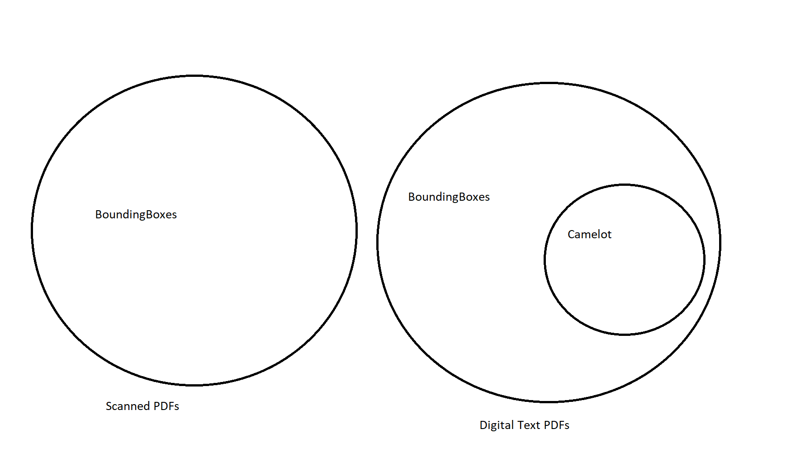

# Table detection in PDFs using Python

Nothing new that I'm doing here, just trying to fine tune it for my use case.
GCP's DocumentAI already does a great job at extracting structured data, but the ask was for an open source solution due to security constraints.

Inspired by these blogs:
 - https://towardsdatascience.com/a-table-detection-cell-recognition-and-text-extraction-algorithm-to-convert-tables-to-excel-files-902edcf289ec

Notes:
- C:/Users/swaha/AppData/Local/Programs/Python/Python39/python.exe -m pip install opencv-python

### Questions for Ranadheer:
- How do you distinguish between digital text and scanned PDFs
- Is it okay to assume that a PDF that is digital is digital throughout and vice versa?
- Does this distinguishing happen at page level or document level?
- Is there too much time complexity right now?
- If there is only a table in the page its possible, but how to know where to apply bounding boxes when the table is just one part of a whole page with rest of it being regular text
- Current progress
- Please share sample PDFs
- How do you want the output, as a csv, df..? And any other metadata like spatial position?

## Conclusion

If the PDF is text-based, use Camelot for 100% accurate results 
    But not all text based PDF's tables get detected.

If the PDF is scanned/image-based, use bounding boxes method